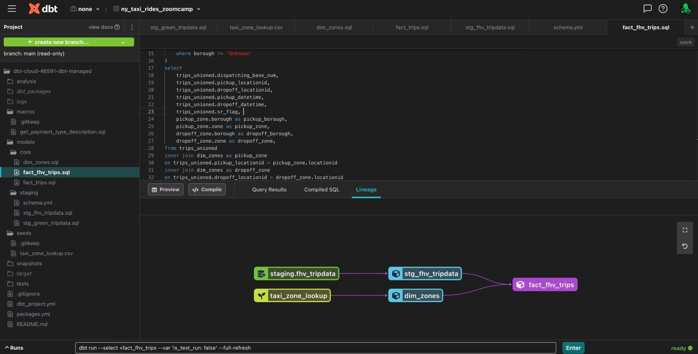

I accidentally started working in managed dbt repository and didn't find a way to download the repo to my local machine. To prove my words I leave a screenshot of my working space in dbt cloud:





dbt docs says that the only way to extract managed repo from the cloud environment is to contact thier support:
https://docs.getdbt.com/docs/dbt-cloud/cloud-configuring-dbt-cloud/cloud-using-a-managed-repository

## Homework code:

1. ```SELECT count(*) FROM `praxis-cab-338710.dbt_ihladkyi.fact_trips`
WHERE EXTRACT(YEAR FROM pickup_datetime) IN  (2019, 2020)```

    A: 61635151

2. A: 89.9/10.1

3. ```SELECT count(1) FROM `praxis-cab-338710.dbt_ihladkyi.fact_trips.stg_fhv_tripdata`
where extract(year from pickup_datetime) in (2019)```

    A: 42084899

4. ```SELECT count(*) FROM `praxis-cab-338710.dbt_ihladkyi.fact_fhv_trips`
WHERE EXTRACT(YEAR FROM pickup_datetime) = 2019```
    
    A: 22676253

5. ```SELECT COUNT(1) AS `count`, FORMAT_DATE('%b-%Y', pickup_datetime) mon_year FROM `praxis-cab-338710.dbt_ihladkyi.fact_fhv_trips`
GROUP BY mon_year```

    A: January